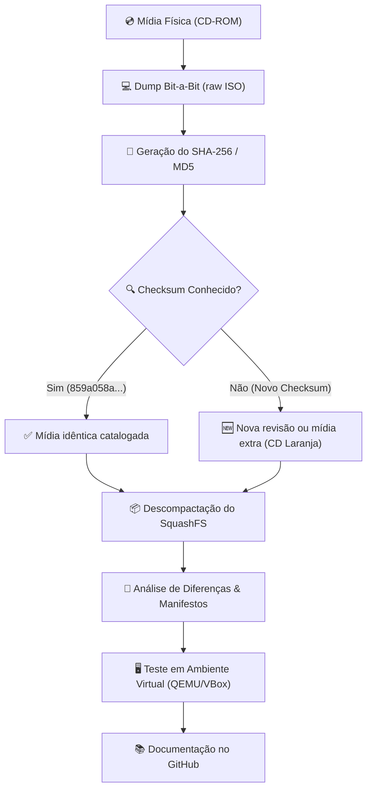

# 🏛️ Metodologia de Preservação Digital — Sunsix Linux

> **Diretrizes, protocolos e metodologias para a conservação digital de mídias de software legado e distribuições OEM.**

---

## 🎯 1. Objetivos da Preservação

O projeto de preservação do **Sunsix Linux** visa garantir que os artefatos digitais dessa distribuição permaneçam acessíveis, verificáveis e auditáveis para fins de pesquisa técnica e histórica.

Preservar software legado exige ir além da simples conservação de um arquivo ISO: é necessário registrar sua integridade, seu contexto de uso e as especificidades do hardware em que rodava.

---

## 🔬 2. Os 5 Pilares da Metodologia



### Pillar 1: Captura Bit-a-Bit e Checksums
* As mídias ópticas físicas (CD-ROMs) devem ser lidas diretamente em modo bruto (*raw*) utilizando ferramentas de cópia exata (como `dd`, `ddrescue` ou utilitários de dump de CD).
* Toda mídia preservada deve possuir hashes criptográficos gerados imediatamente após a extração:
  * **SHA-256** (padrão principal do projeto)
  * **MD5** (para compatibilidade histórica)
* **Regra de Ouro:** Qualquer alteração nos bytes do arquivo inutiliza a cópia como preservação original. Modificações ou customizações devem ser armazenadas em branchs/arquivos separados.

### Pillar 2: Registro do Contexto Físico
* Fotografias de alta resolução das mídias originais (rótulos, cores dos CDs como o CD Azul e o CD Laranja).
* Registro das inscrições da matriz da mídia (código impresso no anel central do CD).
* Fotografias e transcrições de manuais de garantia, folhetos de instrução e etiquetas coladas nos gabinetes dos computadores Sunsix.

### Pillar 3: Extração e Análise Estrutural
* Montagem e descompactação em cópias de trabalho para catalogar:
  * Estrutura do Live System (`casper/filesystem.squashfs`).
  * Lista completa de pacotes instalados (`dpkg -l` ou manifesto).
  * Arquivos de configuração do sistema (`/etc/lsb-release`, `/etc/issue`, `/etc/gdm/`).
  * Elementos visuais (wallpapers, ícones, splash screen).

### Pillar 4: Preservação da Executabilidade
* Garantir que o sistema permaneça testável através de instruções atualizadas para hipervisores modernamente suportados (VirtualBox, QEMU, 86Box).
* Documentar soluções de compatibilidade para executar kernels legados (série 2.6.20) em CPUs modernas sem quebras de ACPI ou aceleração de vídeo.

### Pillar 5: Documentação Aberta e Auditabilidade
* Todo o conhecimento extraído deve ser registrado em formato Markdown e versionado em repositório público (Git).
* Manter clara a distinção entre **fatos confirmados** (evidências diretamente observadas na mídia) e **hipóteses/relatos**.

---

## 🤝 3. Guia de Contribuição de Novas Mídias

Se você possui um CD original do Sunsix Linux ou de computadores Sunsix:

1. **Não altere o conteúdo do CD.**
2. Gere a imagem ISO da mídia física.
3. Calcule a soma de verificação SHA-256:
   ```bash
   sha256sum sunsix-media.iso
   ```
4. Verifique se o checksum coincide com a cópia já preservada:
   ```text
   859a058aaffb378d7a01c6420ac81a9d81f983967e4b880a7c3eb1301280b388
   ```
5. **Se o checksum for diferente:** Não descarte! Isso indica uma possível revisão diferente do sistema, lote de fabricação ou CD de extras (ex: CD Laranja). Entre em contato ou abra uma Issue no repositório.

---

## 📚 Referências e Links Relacionados

* 🔬 [`technical-analysis.md`](technical-analysis.md) — Dossiê técnico e análise da ISO
* 📜 [`history.md`](history.md) — Contexto histórico da Sunsix e dos PCs populares
* 🛠️ [`troubleshooting.md`](troubleshooting.md) — Guia de virtualização e troubleshooting
